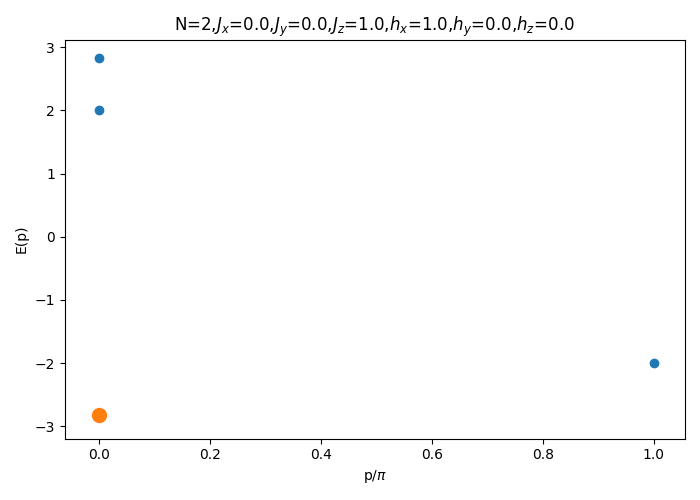

# 
 Transverse_Ising_Qiskit 

A python code for the computation of excited states of the Transverse Ising model through the use of a Qiskit circuit.
## The structure of the code is as follows:
<ul>
  <li>In the file <b>"E.py "</b> the is the definition of the Heisenberg Hamiltonian and the momentum operator. 
</li>
  <li>The <b>"matrix_plot.py"</b> can by used to create 2d plots from the matrices in <b>"E.py"</b> as well a scatter plot of momenta vs Energy of the excited states.
    
</li>
  <li>The <b>"circuit.py"</b> has definitions of the circuits that can be used for the computations.
</li>
  <li>The <b>"states.py"</b> creates the <b>"state_dict.py"</b> file which contains the eigenvalues and eigenvectors of the Heisenberg Hamiltonian.
</li>
  <li>The <b>"b_values.py"</b> creates the <b>"b_values_data.py"</b> which contains the b arrays used for the computation of excited states.
</li>
  <li>The <b>"optimizing.py"</b> is the main file for optimization.
</li>
  <li>The <b>"optimizing_functions.py"</b> contains the definition of functions used for the computation of the ground and excited states.
</li>
  <li>The <b>"custom_optimizers.py"</b> contains a function for sequencial optimization.
</li>
  <li>The <b>"main.py"</b> is the central file through which the user may interact. 
</li>
  <li>The resulting plots and data are created in the /trial folder.
</li>
</ul>

## Some additional Info:
<ul>
If the user wants to use some other quantum information library other than Qiskit all she/he has to do is to change the circuits.py file and the psi function in the optimizing_finctions.py file where the use of Qiskit take place.
</ul>

## Dependencies:
<ul>
  <li>Qiskit
</li>
  <li>scipy
</li>
  <li>sys
</li>
  <li>matplotlib
</li>
  <li>numpy
</li>
  <li>pathlib
</li>
</ul>

Please note that the code is currently under heavy customization.
The code is made to test arXiv:2002.06210v2 and arXiv:1805.08138v5
